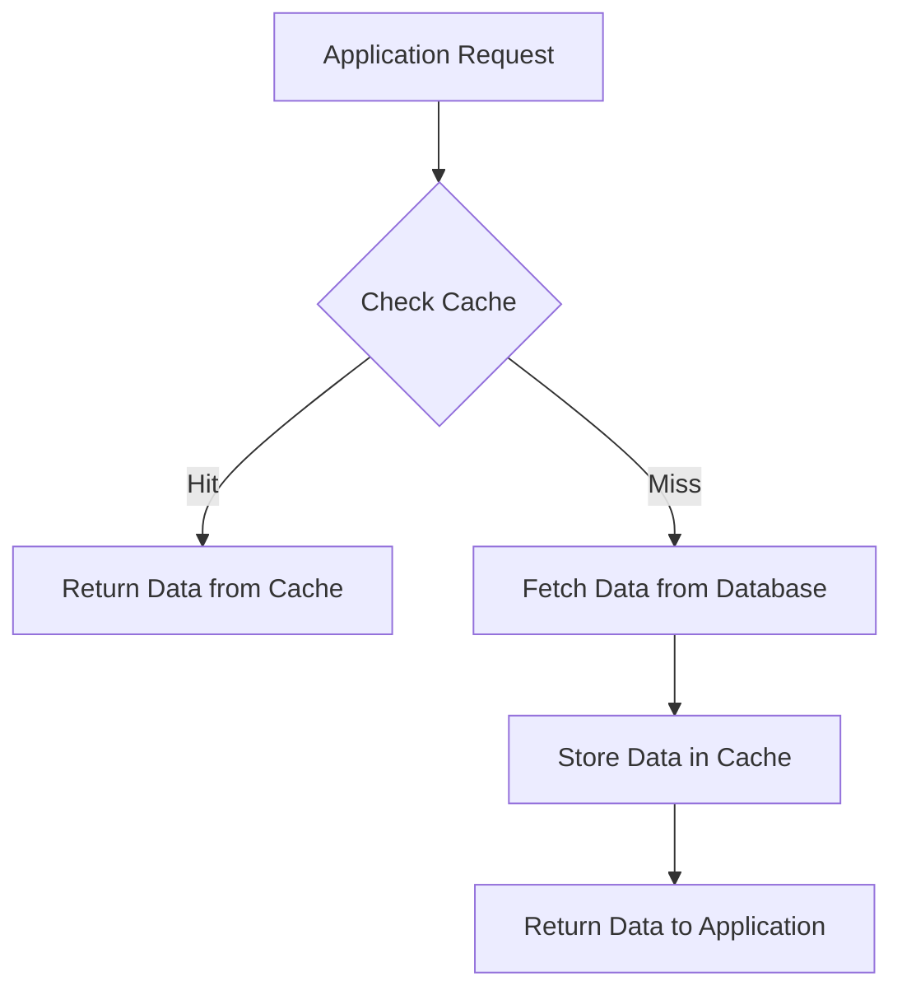
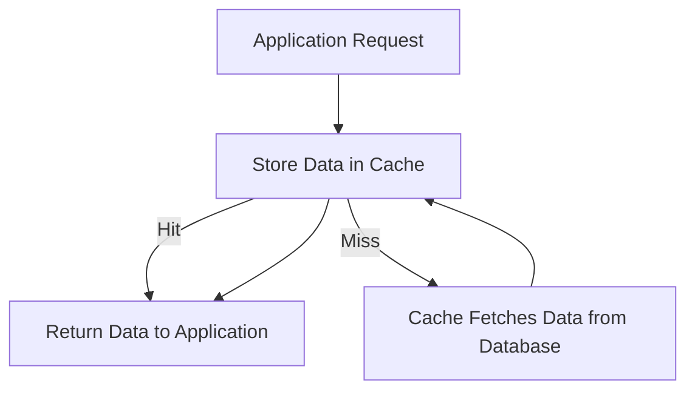
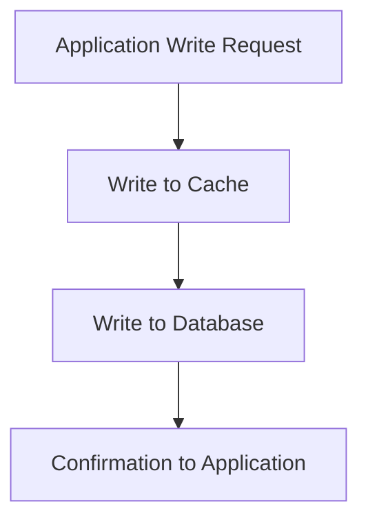
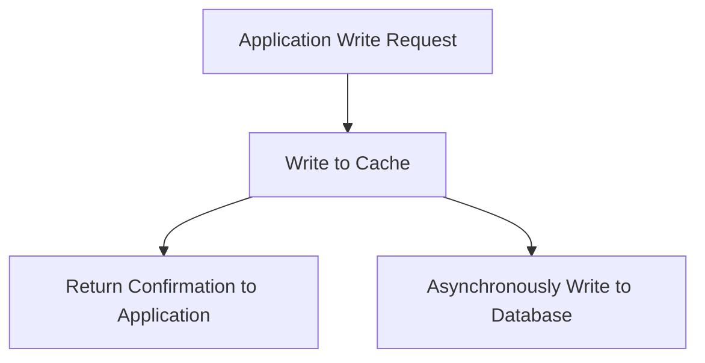

# In-Memory Caching & Strategies

## Introduction to Caching

Caching is a technique used to store frequently accessed data in a fast storage layer to reduce the time it takes to access that data in the future. In modern applications, retrieving data directly from databases or external services can be slow due to network latency, I/O operations, or computational complexity. By storing a copy of this data in a cache, applications can respond more quickly to repeated requests.

Think of caching as having a whiteboard in your office with commonly referenced information instead of looking it up in a filing cabinet each time. It improves performance and reduces the load on slower resources.


---

## Types of Caches

### 1. In-Memory Cache

In-memory caches store data directly in the RAM of a server or application process. This allows extremely fast access times, often measured in microseconds. The downside is that data in RAM is volatile and will be lost if the process restarts. In-memory caches are best for data that is read frequently but does not require long-term persistence.

**Use Cases:** Session storage, configuration settings, computed results, frequently accessed product data.

### 2. Distributed Cache

Distributed caches span multiple servers or nodes, making them suitable for scalable applications where multiple instances of a service need to share the same cached data. Examples include Redis and Memcached.

**Use Cases:** Large-scale e-commerce sites, social media feeds, or multi-server web applications.

### 3. Client-Side Cache

Client-side caching involves storing data on the user's device, such as in the browser or mobile application. This reduces network calls and improves performance for repeated accesses.

**Use Cases:** Storing API responses, static assets, user preferences.

---

## Benefits of Caching

Caching is not just about speed. It also improves system efficiency, reduces costs, and enhances user experience.

- **Lower Latency:** Accessing data from cache is faster than hitting a database or external service.
- **Reduced Backend Load:** Fewer database queries reduce server strain.
- **Cost Savings:** Reduced computation and I/O lowers infrastructure costs.
- **Enhanced User Experience:** Users get faster responses and smoother interactions.

---

## In-Memory Caching in Depth

In-memory caching is the fastest type of caching because it uses RAM instead of disk storage. It is particularly effective for applications with frequent read operations. Since memory is limited, managing what stays in cache is essential.

**Key Considerations:**

- **Volatility:** Data is lost on server restart.
- **Memory Limit:** Requires careful sizing and eviction policies.
- **Consistency:** Cached data may become stale; strategies must handle updates.


---

## Caching Strategies Explained

### Cache-Aside (Lazy Loading)

In the cache-aside pattern, the application is responsible for reading and writing from/to the cache. When a request arrives:

1. Check the cache.
2. If present (cache hit), return the data.
3. If absent (cache miss), fetch from the database, store it in the cache, then return it.

This approach keeps cache and database loosely coupled, but the application must handle cache population and invalidation.



### Read-Through

The cache acts as a mediator between the application and the database. On a cache miss, it automatically loads data from the database, stores it in the cache, and returns it. This centralizes cache management, reducing application complexity.



### Write-Through

With write-through caching, all writes go to both the cache and the database synchronously. This guarantees strong consistency because the cache and database always reflect the same data. The trade-off is slightly slower write operations.



### Write-Behind (Write-Back)

Write-behind caching allows applications to write data to the cache first and asynchronously update the database later. This improves write performance but introduces potential data loss if the cache fails before writing to the database. Proper monitoring and retry mechanisms are essential.



---

## Eviction Policies

When the cache reaches its maximum capacity, it cannot store new data without removing some existing entries. **Eviction policies** define which items get removed to make space. Choosing the right policy ensures that the cache continues to provide fast access to the most useful data.

### 1. Least Recently Used (LRU)

- **Description:** Removes the item that has not been accessed for the longest time.
- **Assumption:** Data used recently will likely be used again soon.
- **Example:** In a cache of 3 items `[A, B, C]`, if `A` was used long ago, it will be evicted first when adding a new item `D`.

### 2. Least Frequently Used (LFU)

- **Description:** Removes the item that is accessed the fewest times.
- **Assumption:** Data that is rarely accessed is less valuable.
- **Example:** If item `B` has been accessed only once while `A` and `C` were accessed 5 times, `B` will be evicted first when the cache is full.

### 3. First In, First Out (FIFO)

- **Description:** Removes the oldest item in the cache.
- **Assumption:** Older data is less relevant than newer data.
- **Example:** In `[A, B, C]`, `A` was added first, so `A` is removed when adding `D`.

### 4. Random Eviction

- **Description:** Removes a random cache entry.
- **Notes:** Simple but sometimes effective if access patterns are unpredictable.

---

## Metrics and Monitoring

To know if a cache is working well, we need to track some important numbers. Here’s what they mean and how to measure them:

- **Cache Hit Rate:**

  - **What it is:** Percentage of requests answered directly from the cache. Higher is better.
  - **How to measure:** Count the number of cache hits ÷ total requests × 100.
    ```text
    Cache Hit Rate = (Cache Hits / Total Requests) * 100%
    ```

- **Cache Miss Rate:**

  - **What it is:** Percentage of requests that are not in the cache and must be fetched from the database. Lower is better.
  - **How to measure:** Count the number of cache misses ÷ total requests × 100.
    ```text
    Cache Miss Rate = (Cache Misses / Total Requests) * 100%
    ```

- **Eviction Rate:**

  - **What it is:** How often items are removed from the cache to make space.
  - **How to measure:** Count the number of evicted items over a period of time.
    ```text
    Eviction Rate = (Number of Evictions / Time Period)
    ```

- **Data Freshness:**
  - **What it is:** How up-to-date the cached data is, so users don’t see old information.
  - **How to measure:** Track the age of items in the cache (current time − last updated time).
    ```text
    Data Age = Current Time - Last Updated Time
    ```

> Most caching systems like Redis, Memcached, or in-memory libraries provide built-in stats or commands to get these metrics easily.

---

## Example Scenarios of In-Memory Caching

### 1. E-Commerce Website

In an online store, certain products are extremely popular and frequently viewed by users. Fetching product details, prices, and availability from the database every time a user visits the page can slow down the website and put heavy load on the server. By using in-memory caching, these frequently requested items can be stored in RAM, allowing the website to serve them almost instantly.  
**Benefits:**

- Faster page loads for users browsing popular products.
- Reduced database queries, improving scalability.
- Ability to handle traffic spikes during promotions or sales.

---

### 2. Mobile Application

Mobile apps often rely on APIs to fetch user-specific data, like profile information, preferences, or notifications. Every network request consumes bandwidth and may introduce latency. By caching user session data and recently fetched API responses locally on the device or in a memory layer, the app can respond immediately to repeated requests without contacting the server every time.  
**Benefits:**

- Improved app responsiveness and smoother user experience.
- Reduced network calls, saving data usage and battery.
- Ability to work offline or in low-connectivity scenarios with cached data.

---

### 3. Analytics Platform

Dashboards in analytics platforms often display complex computations, such as aggregated metrics, charts, and reports. Calculating these metrics on-the-fly for every user request can be slow and resource-intensive. By caching computed results in memory, the platform can instantly serve dashboards to users while still updating cached values periodically as new data arrives.  
**Benefits:**

- Real-time or near real-time dashboard updates.
- Reduced computation on backend servers.
- Consistent performance for multiple users accessing the same reports simultaneously.

---

## Best Practices for Caching

Effective caching is not just about storing data—it requires thoughtful strategies to maintain performance, consistency, and reliability. Here are some key best practices:

1. **Set Appropriate TTL (Time to Live)**  
   Assign a TTL to each cached item to control how long it stays in the cache. A proper TTL balances data freshness with performance. Too short and you get frequent cache misses; too long and users may see outdated information.

2. **Invalidate Cache When Data Changes**  
   Whenever the underlying data is updated in the database, make sure to invalidate or update the corresponding cache entries. This prevents serving stale data to users.

3. **Cache High-Value or Expensive-to-Compute Data**  
   Focus on caching data that is accessed frequently or requires heavy computation. Avoid caching rarely used data, as it wastes memory and may increase eviction of important entries.

4. **Monitor Metrics and Adjust Cache Configuration**  
   Regularly track cache hit rate, miss rate, eviction rate, and data freshness. Use these metrics to adjust cache size, eviction policies, and other strategies to maintain optimal performance.

5. **Use Distributed Caching for Scalable Systems**  
   When an application runs on multiple servers, a distributed cache (like Redis or Memcached) ensures all instances share the same cache, maintaining consistency and supporting scalability.

---
