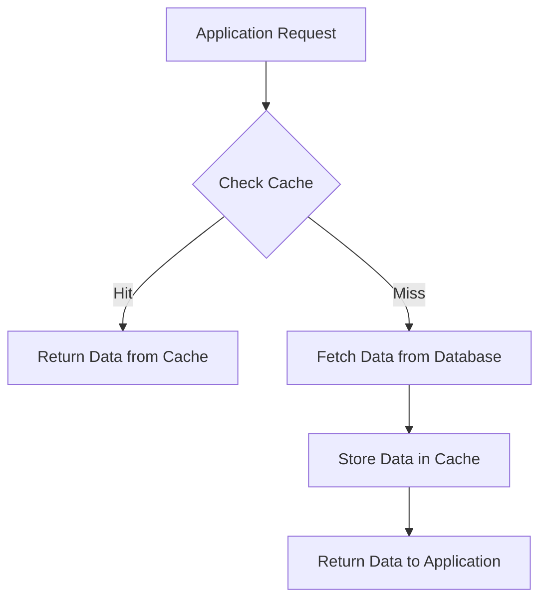
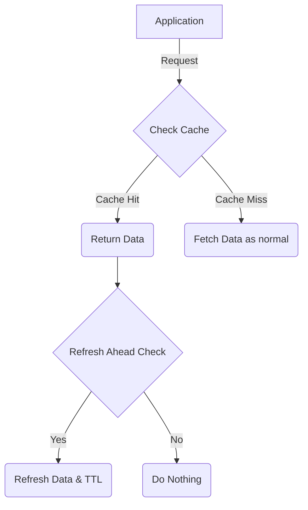
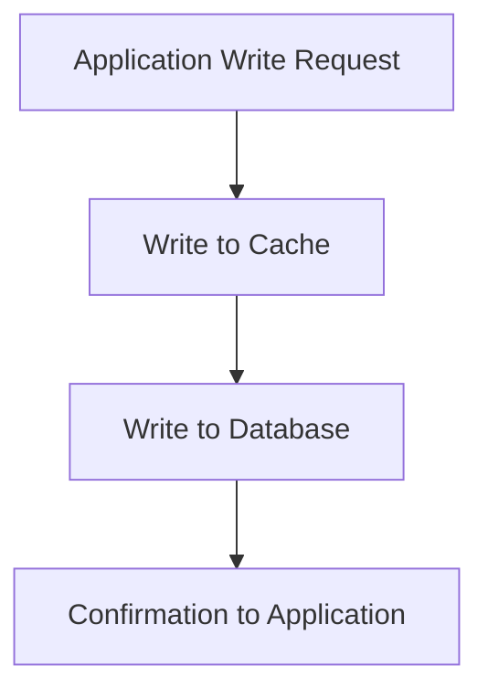
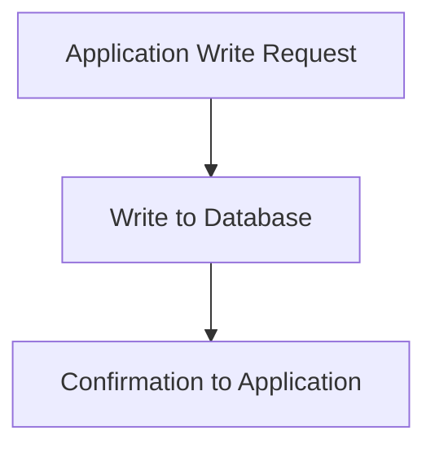

## What is caching ? 

In order to shorten the time it takes to access **frequently accessed data** in the future, **caching** is a technique used to store that data in a **fast storage layer**. Due to **network latency, I/O operations, or computational complexity**, direct data retrieval from databases or external services can be slow in contemporary applications. Applications can react to **repeated requests** faster by keeping a **copy of this data** in a cache.

A good metaphor for **caching** would be to imagine a **notepad** where you keep key details rather than **digging through the archives** every time you need them. This way you spend **less time searching** for the information.


## Types of Caches

The idea is straightforward, but how it is put into practice depends on who needs **access to the data** and where it is **kept**.

Here are a few examples of caching types:

### 1. In-Memory Cache

Data is directly **stored in the RAM** of a server or application process by in-memory caches. This enables **extremely fast** access times, which are frequently expressed in microseconds. RAM data is volatile and will be lost if the process restarts. For data that is frequently read but 
**does not** need **long-term persistence**, in-memory caches work best.

**Use Cases:** Session storage, configuration settings, computed results, frequently accessed product data.

### 2. Distributed Cache

**Distributed caches** are appropriate for **scalable applications** where multiple instances of a service must **share the same cached data** because they span **multiple servers or nodes**. Redis and Memcached are two examples.

**Use Cases:** Large-scale e-commerce sites, social media feeds, or multi-server web applications.

### 3. Client-Side Cache

Data is stored on the user's device, such as in a mobile application or browser, as part of client-side caching. For frequent accesses, this lowers network calls and boosts performance.

**Use Cases:** Storing API responses, static assets, user preferences.


## Benefits of Caching

Caching is not just about speed. It also improves system efficiency, reduces costs, and enhances user experience.

- **Lower Latency:** Accessing data from cache is faster than hitting a database or external service.
- **Reduced Backend Load:** Fewer database queries reduce server strain.
- **Cost Savings:** Reduced computation and I/O lowers infrastructure costs.
- **Enhanced User Experience:** Users get faster responses and smoother interactions.


## In-Memory Caching in Depth

In-memory caching stores data directly in RAM, which makes it the fastest type of caching available. Accessing data from memory is significantly quicker than reading from a database or disk, often measured in microseconds. This makes in-memory caching ideal for applications that frequently read the same data, such as popular product details, session information, or computed results.

However, because memory is limited, careful management is necessary to ensure efficiency and reliability.

**Key Considerations:**

1. **Volatility:**  
   Data stored in memory is temporary. If the server restarts or crashes, all cached data is lost. It's important to have mechanisms to repopulate the cache when needed.

2. **Memory Limit:**  
   RAM is a finite resource. You need to carefully size your cache and choose appropriate eviction policies to ensure that the most important data remains accessible while less critical data is removed.

3. **Consistency:**  
   Cached data can become outdated if the original data changes. Strategies such as cache invalidation, TTL (Time to Live), or write-through/write-behind policies help maintain consistency between the cache and the underlying database.


## Elements of a In memory Cache

To build an in-memory caching system you'll have to decide on multiple factors and moving parts.

When choosing these elements you'll have to take in consideration the following:
- Resource limits: Since caching is in RAM, designing a system that relies on it also calls for taking in consideration its limits.
- Consistency: Some techniques in caching require desynchronizing the database and persistant data storage from the cache, this risks losing some data if unforeseen events happen.


### Loading Strategies

The first element of building a cache is deciding how to load data that <u>already</u> exists into the cache.

#### Cache Aside
This is the most common loading strategy it simply states:
- If the data is requested and not in the cache
- Then load that data in the cache

This loading strategy is fine for most applications as it doesn't populate the cache with unused data.



#### Refresh Ahead

This is a more complicated loading strategy, it solves the following problematic with popular TTL (time to live) based caches.

Problematic:
- Popular data points dont get exempt from the TTL invalidation policy and will result in a cache every time TTL reaches 0.

Solution:
- Create a system that refreshes popular data point

So how refresh ahead creates this system is as follows:
- set a certain `refresh-ahead-factor` to a number between 0 and 1
- everytime a data point is accessed check:
$$
TTL_t < TTL_0 \ \cdot \ refresh\_ahead\_factor
$$
- If this is true then immediately fetch the data and reset the TTL of that data point




### Writing Strategies

Writing strategies define what you do when a certain data point is added, updated, or deleted from the database.
#### Write-through

This writing system updates both the cache and the database synchronously.

This writing system ensured strong consistency between the database and the cache, but makes writes more expensive as they have to do 2 operations.



#### Write-Aside

this writing strategy only writes to the database and ignored the cache, the benefit of this strategy is that the cache is not populated by non-accessed data, but fails when read after writes are very common since an immediate cache miss will happen.




#### Write-behind

This writing strategy only writes to the cache and queues up the database writes asynchronously to be processed during times on lesser load.

This strategy thrives in high availability contexts where a lot of data is accessed after its written but introduces complexity in the form of asynchronous database writes and the possibility of data loss if the application crashes before a batch is processed.

 ```mermaid
flowchart TD
    A[Application Write Request] --> B[Write to Cache]
    B --> C[Return Confirmation to Application]
    B --> D[Asynchronously Write to Database]
```

### Eviction Policies

In most systems the cache will have an upper limit on how many keys it can store, this then calls for a system to liberate space when it gets full.
#### LRU (Least Recently Used)

In this system, the key that hasn't been accessed for the longest time gets evicted from the cache.

This assumes that data that's being reused will be reused again 

#### LFU (Least Frequently Used)

In this system, the key that has been accessed the least will be evicted first

This assumes that data that isn't being accessed frequently is less valuable.

#### FIFO (First in, first out)

In this system, the cache will keep track of when keys where added and removes the oldest key first.

This is good when your system is linear, i.e. when data is most used right after its accessed the first time.

#### Random Eviction

The simplest eviction policy, pick a key and remove it.

This is good if there is no particular pattern to data access and the most important aspect is just getting new space.

### Invalidation Strategies

Cache invalidation, is when data is updated in persistant storage but it is stale in the cache.

We use multiple ways to make sure our cache is up to date with the persistant storage (database).

#### Manual

The simplest invalidation technique, when the application updates the storage it goes and updates the cache entry.

This does also mean that writes are now heavier since they also update the cache.
#### TTL Based

The most common strategy, allowing stale data but only for a certain period of time until it gets invalidated.

It works by setting a time to live (TTL) to any data that enters the cache, and when that time is over it is automatically invalidated and deleted from the cache.

#### Write-event Based

This strategy invalidates the current data after every write in the database.

This makes the database and the cache coupled but also maintains strong consistency.

## Guidelines on setting up your cache

Each system requires a different configuration to get the most out of the cache, but there is a few general guidelines to point you in the correct direction.

### Consistency

You need to decide if your system requires a strong consistency between the cache and the database and if stale data in either one is acceptable.

If the answer is yes then strategies such as write-behind and TTL Based invalidation are usually the best.
### Read-heavy / Write-heavy

A common mistake for caches is thinking of the entire system as 1 data type, while it might be true for some small systems, most of us have multiple data types each with its own access pattern.

Example:
In a document writing platform like google docs we might have:
- Actual document text: High-write
- Document metadata: High-read

In this case it is wise to cache the document metadata as write-heavy workloads aren't fit for caching.

### When not to cache

There are many cases where a cache is rather unnecessary.
These include:
- High-write workloads: if your system receives more writes than reads, they can not be cached as the data will get invalidated too quickly
- Smaller systems: if your system is small and not complex, it should not include caching as that's another layer of complexity to manage in the code.
- Low reuse: if the data is accessed only a few times for its lifetime then adding a cache is not needed as most of the data will be evicted or invalidated and not used.


## Metrics of performance

To monitor if a cache is working correctly, we can mesure multiple metrics:

### Cache Hit rate

This shows the general effectiveness of a cache, it represents how many of the requests where fetched from cache.
$$
Cache\ Hit\ Rate = (Cache\ hits \ / \ Total \ Requests ) \ \cdot 100
$$

### Cache Miss rate

This metric shows how often data that isn't in the cache gets requests and thus take longer due to the database.
$$
Cache\ Miss\ Rate = (Cache\ Miss \ / \ Total \ Requests ) \ \cdot 100
$$

### Eviction rate

Shows how often items are evicted, if it is high then the cache is probably overwhelmed and must be expanded.

$$
Eviction\ Rate = Number\ of\ evictions \ / \ Time \ Period 
$$

### Data freshness

Shows how lagged behind the cache is from the database, this is usually high in systems that don't have time to update the cache.

$$
Data \ Age = \ Current\ Time - \ Last \ Update \ Time
$$


## Cache Locks

Many times, especially in distributed systems you'd have multiple processes / servers all trying to read / write to the same data point.

To avoid race conditions we implement **cache locks** which -- as the name suggests, locks a certain key from being modified until the current process is done with it.

When the process is done with the key it releases the lock and marks it available for another write / read.

This is especially useful in distributed systems where multiple servers might access the same data point.


